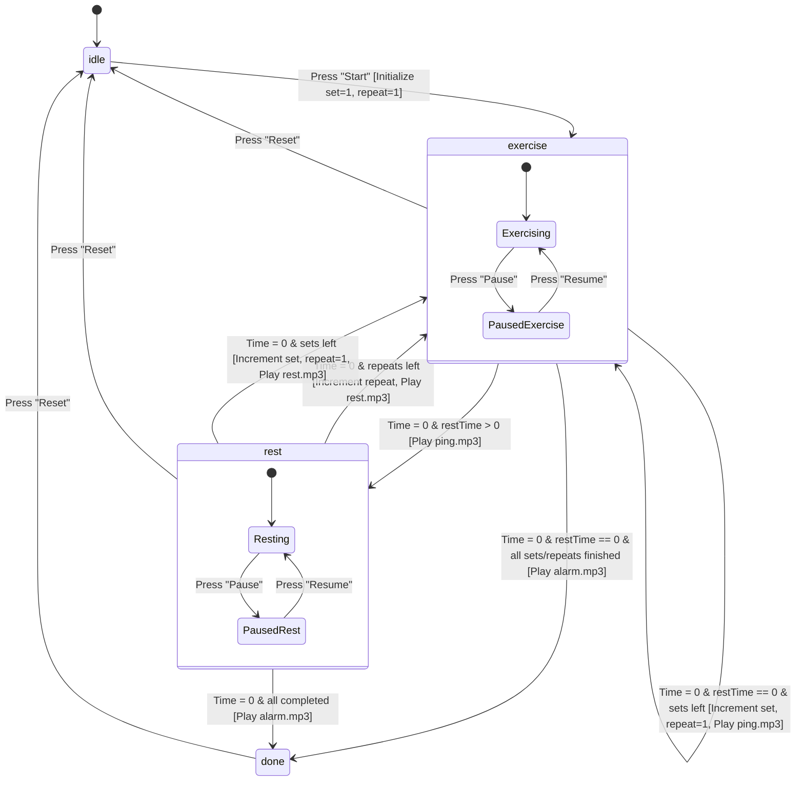
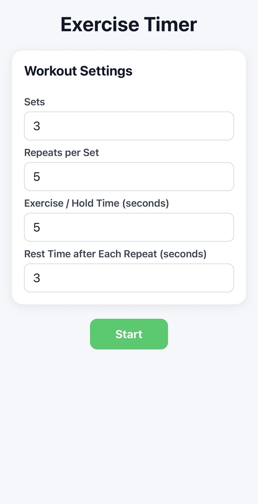
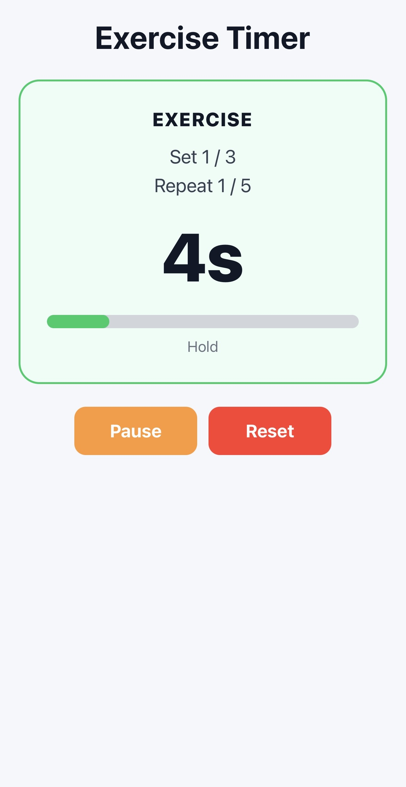
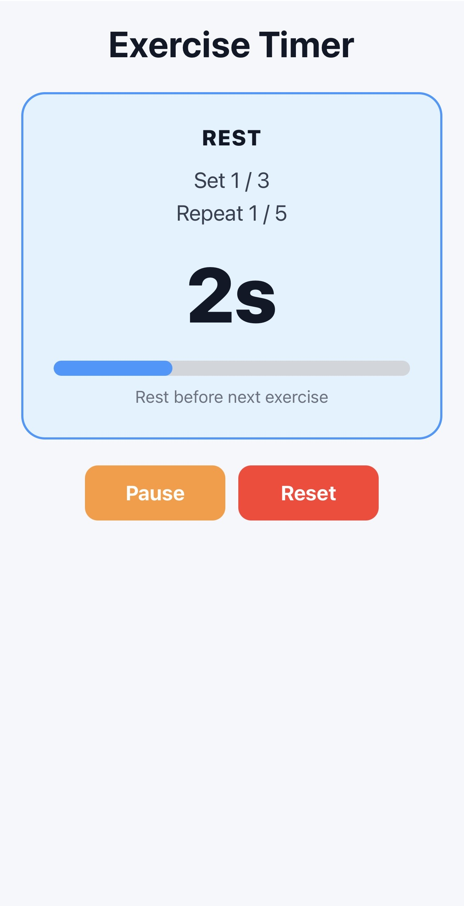
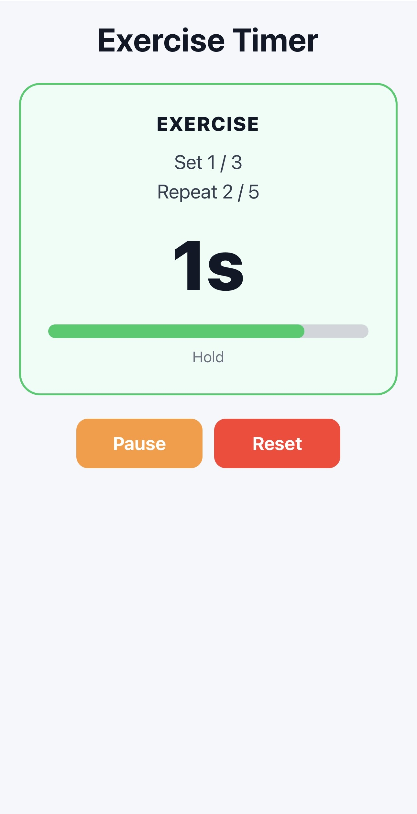
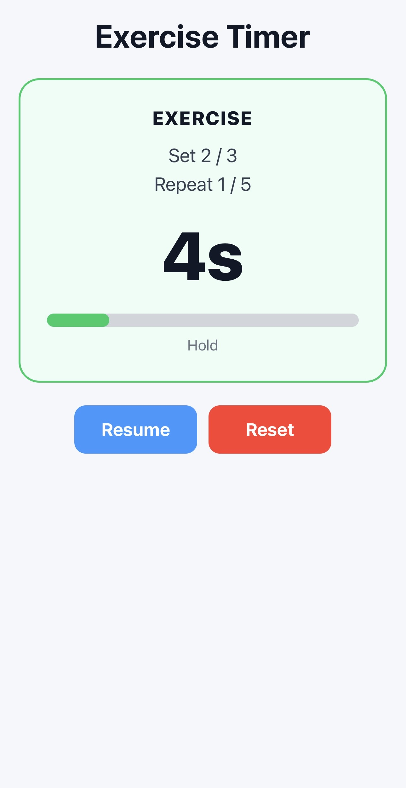
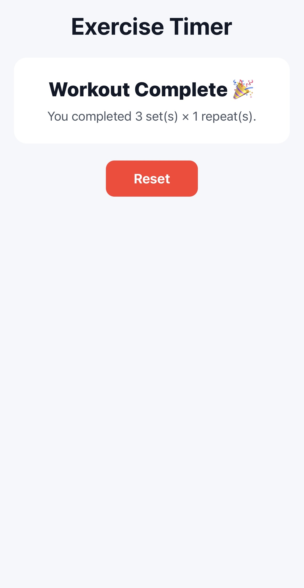

# Exercise Timer RN ⏱️

A React Native & Expo mobile application for managing set-based exercise interval timers. It features configurable sets, repeats per set, exercise/hold durations, and rest periods with audio cues and animated progress feedback.

---

## 🛠️ Project Overview

This app is built with **React Native** and **Expo Router** using **TypeScript**. It provides an intuitive interval workout timer designed for interval training, isometric holds, and repeated exercise routines.

### Key Features

- **Configurable Workout Settings**: Set custom counts for **Sets**, **Repeats per Set**, **Exercise / Hold Time**, and **Rest Time**.
- **Interactive Timer UI**: Visual distinction between active Exercise (green) and Rest (blue) phases with continuous progress fill.
- **Audio Notifications**: Pre-loaded audio cues using `expo-audio` (`ping.mp3` on exercise completion, `rest.mp3` on rest completion, and `alarm.mp3` when the entire workout finishes).
- **Pause & Resume Controls**: Pause mid-workout or reset at any time.
- **Cross-Platform UX**: Safe-area context, keyboard handling (`KeyboardAvoidingView`, `InputAccessoryView` on iOS), and platform-specific styling.

---

## 🏛️ Architectural Design

The app follows a single-screen, component-driven reactive architecture built on React hooks and Expo modules.

```
┌─────────────────────────────────────────────────────────┐
│                     App Entry / Router                  │
│                     (expo-router / app)                 │
└───────────────────────────┬─────────────────────────────┘
                            │
┌───────────────────────────▼─────────────────────────────┐
│                    Exercise Timer Screen                │
│                       (app/index.tsx)                   │
├───────────────────────────┬─────────────────────────────┤
│  State & Configuration    │  Timer Subsystem            │
│  - Settings State         │  - setInterval Engine       │
│  - Phase & Count State    │  - Countdowns & Logic       │
├───────────────────────────┼─────────────────────────────┤
│  Audio Subsystem          │  UI & Layout                │
│  - setAudioModeAsync      │  - Settings Input View      │
│  - useAudioPlayer         │  - Dynamic Timer Card       │
│  - Sound Players          │  - Controls & Keyboard      │
└───────────────────────────┴─────────────────────────────┘
```

### Component & Folder Structure

- **`app/index.tsx`**: Core application component holding workout configuration state, phase machine, countdown timer engine, sound triggers, and responsive layout.
- **`assets/sounds/`**: Sound assets (`ping.mp3`, `rest.mp3`, `alarm.mp3`).
- **`package.json`**: Dependency manifest (`expo`, `expo-audio`, `react-native`, `expo-router`, etc.).

### System Responsibilities

1. **Configuration Layer**: Validates and normalizes numerical inputs (`sets`, `repeats`, `exerciseTime`, `restTime`).
2. **Timer Engine**: Uses a `useEffect` loop powered by `setInterval` (`intervalRef`) synced to active state variables (`phase`, `timeLeft`, `isPaused`).
3. **Audio Subsystem**: Configures background/silent audio behavior via `setAudioModeAsync` and controls pre-buffered sound assets via `useAudioPlayer`.

---

## 🔄 Timer State Transitions

The timer system operates as a finite state machine with four core phases (`idle`, `exercise`, `rest`, `done`) and a pause/resume modifier.

### Phase State Diagram



### Detailed State Machine Specs

| Phase                 | Description                                                                    | Next Transitions / Events                                                                                                                                                                                                                                                                      | Audio Trigger                                     |
| :-------------------- | :----------------------------------------------------------------------------- | :--------------------------------------------------------------------------------------------------------------------------------------------------------------------------------------------------------------------------------------------------------------------------------------------- | :------------------------------------------------ |
| **`idle`**            | Initial configuration screen. User inputs sets, repeats, hold time, rest time. | → **`exercise`** on `startTimer()`                                                                                                                                                                                                                                                             | None                                              |
| **`exercise`**        | Exercise / hold countdown in progress (`timeLeft` decrements every 1s).        | • If `timeLeft == 0` & `restTime > 0` → **`rest`**<br>• If `timeLeft == 0` & `restTime == 0` & repeats remaining → **`exercise`** (next repeat)<br>• If `timeLeft == 0` & `restTime == 0` & sets remaining → **`exercise`** (next set)<br>• If `timeLeft == 0` & workout complete → **`done`** | **`ping.mp3`** played when exercise duration ends |
| **`rest`**            | Rest countdown in progress.                                                    | • If `timeLeft == 0` & repeats/sets remaining → **`exercise`**<br>• If `timeLeft == 0` & workout complete → **`done`**                                                                                                                                                                         | **`rest.mp3`** played when rest duration ends     |
| **`done`**            | Workout completed summary card displayed.                                      | → **`idle`** on `resetTimer()`                                                                                                                                                                                                                                                                 | **`alarm.mp3`** played when entering `done`       |
| **`isPaused = true`** | Pauses timer interval without resetting state values.                          | → Resumes active phase on `resumeTimer()`                                                                                                                                                                                                                                                      | None                                              |

---

## 🚀 Getting Started

### Prerequisites

- Node.js (v18 or higher recommended)
- Expo Go app on iOS/Android or a configured iOS Simulator / Android Emulator

### Installation

```bash
# Clone repository and enter directory
cd exercise-timer-rn

# Install dependencies
npm install
```

### Running the Project

```bash
# Start Expo development server
npx expo start

# Run directly on iOS simulator
npm run ios

# Run directly on Android emulator
npm run android
```

## Screenshots







