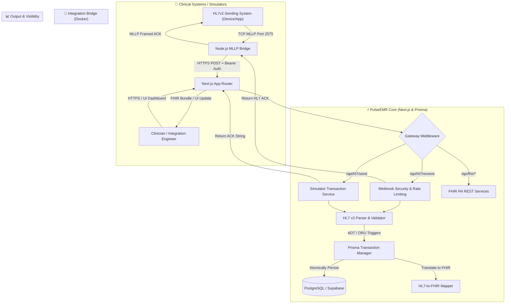

# PulseEMR Virtual EMR & Healthcare Integration Simulator

PulseEMR is a high-fidelity healthcare interoperability simulator designed for developers, integration engineers, and clinical systems architects. It provides a dual-purpose environment: a **Virtual EMR Dashboard** for clinical data visualization and a **Healthcare Integration Engine** for testing HL7 v2 and FHIR R4 data flows.

Built with **Next.js App Router**, **TypeScript**, **Prisma**, and **Prisma Postgres**, it bridges the gap between legacy MLLP messaging and modern cloud-native healthcare APIs.

---

## 🚀 Key Features

- **Virtual EMR Dashboard**: A modern UI for managing patient directories, clinical charts (vitals, labs, conditions), and real-time audit logs.
- **HL7 v2 Simulation Sandbox**: Built-in utility to generate synthetic `ADT^A01` and `ORU^R01` messages and preview their FHIR R4 translations.
- **Bidirectional Interoperability**: 
    - **Inbound**: High-performance MLLP-to-HTTPS bridge for TCP-based HL7 ingestion.
    - **Outbound**: Standardized HL7 ACK (`AA`, `AE`, `AR`) generation and real-time UI updates.
- **FHIR R4 API**: Standards-compliant REST endpoints for `Patient`, `Observation`, and `Condition` resources.
- **Enterprise Security & Audit**:
    - **RBAC**: Role-based access control (`viewer`, `operator`, `admin`) with PBKDF2 hashed credentials.
    - **Webhook Security**: Shared-secret and Bearer token authentication for integration endpoints.
    - **Audit Trail**: Immutable logging of every inbound/outbound clinical message and its processing status.
- **Resilient Persistence**: Powered by Prisma with transactional integrity and graceful in-memory fallbacks for zero-config demos.

---

## 🏗️ Architectural Design & End-to-End Data Flow

PulseEMR is architected as a hybrid virtual EMR and integration gateway. It allows clinical systems to communicate via legacy TCP/MLLP while exposing that same data through modern web technologies.

### System Architecture Flow



### Technical Stack & Component Deep-Dive

1. **MLLP Bridge (`/bridge`)**:
   - A lightweight Node.js service that acts as a "sidecar" or edge gateway.
   - Converts stateful MLLP TCP streams into stateless HTTPS requests.
   - Handles TCP framing (`0x0B...0x1C 0x0D`), framing errors, and connection timeouts.

2. **HL7 Engine (`src/lib/hl7-to-fhir.ts`)**:
   - **Supported Segments**: `MSH`, `PID`, `PV1`, `OBX`, `OBR`.
   - **Supported Events**: `ADT^A01` (Admit), `ADT^A08` (Update), `ADT^A03` (Discharge), `ORU^R01` (Observation Results).
   - **Translation**: Maps ER7 pipe-delimited data to structured FHIR R4 JSON Bundles.

3. **Clinical Database (`prisma/schema.prisma`)**:
   - Normalizes clinical entities into a relational schema optimized for both FHIR retrieval and HL7 processing.
   - Includes `MessageLog` for high-fidelity debugging and message re-playing.

---

## 🛠️ Getting Started

### 1. Local Development Setup

1. **Initialize Environment**:
   ```bash
   cp .env.example .env
   # Set DATABASE_URL and HL7_WEBHOOK_SECRET
   ```
2. **Install Dependencies**:
   ```bash
   npm install
   ```
3. **Database Migration**:
   ```bash
   npm run db:push
   ```
4. **Seed Demo Data**:
   ```bash
   npm run seed
   ```
5. **Run Application**:
   ```bash
   npm run dev
   ```

### 2. Security Configuration (RBAC)

Generate a PBKDF2 hashed record for your users by piping a password from a protected file:
```bash
npm run auth:user -- <role> <username> < password.txt
```
Add the resulting JSON to your `AUTH_USERS` environment variable array.

---

## 🔌 HL7 Integration (MLLP)

To ingest messages from real clinical systems or simulators (like Mirth Connect or 7Edit), deploy the bridge:

```bash
cd bridge
# Configure .env with your VERCEL_WEBHOOK_URL
docker compose up -d --build
```
The bridge listens on **TCP Port 2575**. Ensure your firewall allows ingress from your sending systems.

---

## 🚦 Production Readiness Checklist

Before moving beyond simulation:
1. **Identity**: Integrate with an OIDC provider (Auth0/Okta) instead of the local session store.
2. **Compliance**: Conduct a full HIPAA/SOC2 privacy review. Never use PHI in the simulator.
3. **WAF**: Enable Vercel Edge Config or an external WAF to handle distributed rate limiting.
4. **Networking**: Use a private VPC or VPN between the MLLP bridge and your sending systems.

---

## 📜 License & Disclaimer

This project is for **simulation and testing purposes only**. It is not intended for use in clinical production environments or for processing real patient data (PHI). Use synthetic data exclusively.

## Screenshots


